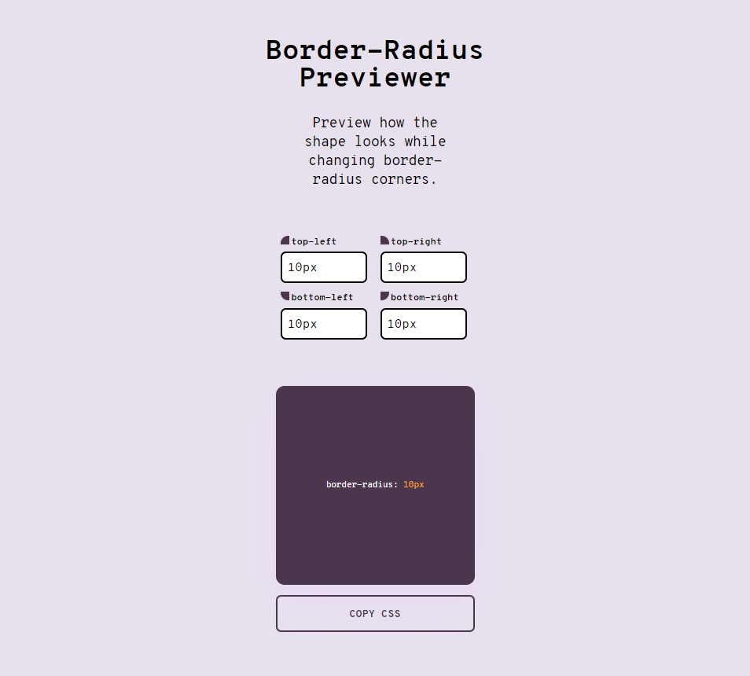

# Border-Radius Previewer Challenge

   [](LICENSE)



> The current repository is part of a personal project. The main goal is to solve all app ideas from [florinpop17/app-ideas](https://github.com/florinpop17/app-ideas) repo. If you like this repo and want to support this journey, be free to donate any value to BTC wallet `3DNssbspq7dURaVQH6yBoYwW3PhsNs8dnK` ❤.

This repo contains a challenge proposed by [florinpop17/app-ideas](https://github.com/florinpop17/app-ideas). Border Radius Previewer allows to preview how a shape looks after applying values to border-radius style. See all challenge details [here](https://github.com/florinpop17/app-ideas/blob/master/Projects/1-Beginner/Border-Radius-Previewer.md).

For this project the language chosen is Vue. Vue is a fast and lightweight framework and it can achieve more easily and fast goals proposed by the project. Typescript also makes part of this project to keep classes, functions, and components typed and organized.

The app has 4 inputs, each one to each border-radius corner. By updating them, a box will reply with border-radius values set. Some values may be marked as invalid since this app only allows values with pixel or percent units. After setting values, the user still can copy the CSS expression to the clipboard.

## How to play with it?

1. Download or clone this repository by typing `git clone https://github.com/caiquearaujo/challenge-border-radius-preview-vue` on your machine;
2. Navigate to the root folder, and type on terminal `npm install && npm run serve`;
3. Server will run at `localhost:8080`.

## User Stories

- :white_check_mark: User can see a box which has a `border-radius` property applied to it
- :white_check_mark: User can change the 4 `border-radius` values that are applied to the box (top-left, top-right, bottom-left, bottom-right)
- :white_check_mark: User can copy the resulting CSS to the clipboard

### Bonus features

Be free to contribute with this project by implementing:

- :white_large_square: User can change all 8 possible values of the border-radius in order to create a complex shape
- :white_large_square: User can set any CSS unit to each corner.


## Project Scripts

### Dependencies installation

Always use at the first time of cloning or acessing the repo.

```
npm install
```

### Compiles and hot-reloads for development

```
npm run serve
```

### Compiles and minifies for production

```
npm run build
```

### Run your unit tests

```
npm run test:unit
```

### Lints and fixes files

```
npm run lint
```

## Changelog

See the [CHANGELOG](CHANGELOG.md) file for information about all code changes.

## Testing the code

This library uses the **Jest**. We carry out tests of all the main features of this application.

```bash
npm run test:unit
```

## Contributions

See the [CONTRIBUTING](CONTRIBUTING.md) file for information before submitting your contribution.

## Credits

- [Caique Araujo](https://github.com/caiquearaujo)
- [All contributors](../../contributors)

## License

MIT License (MIT). See [LICENSE](LICENSE).
